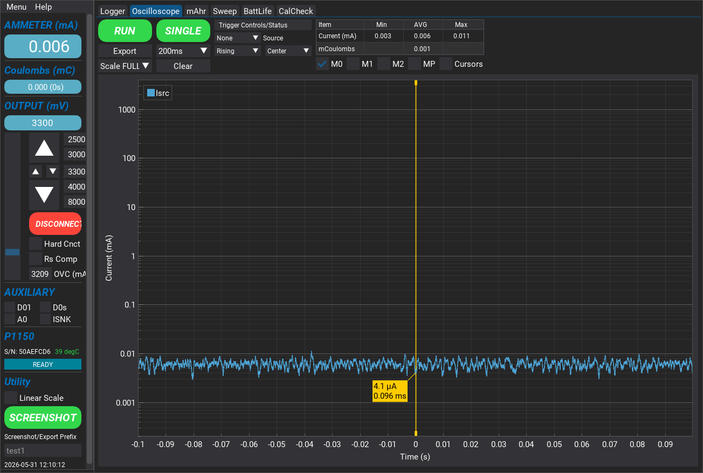
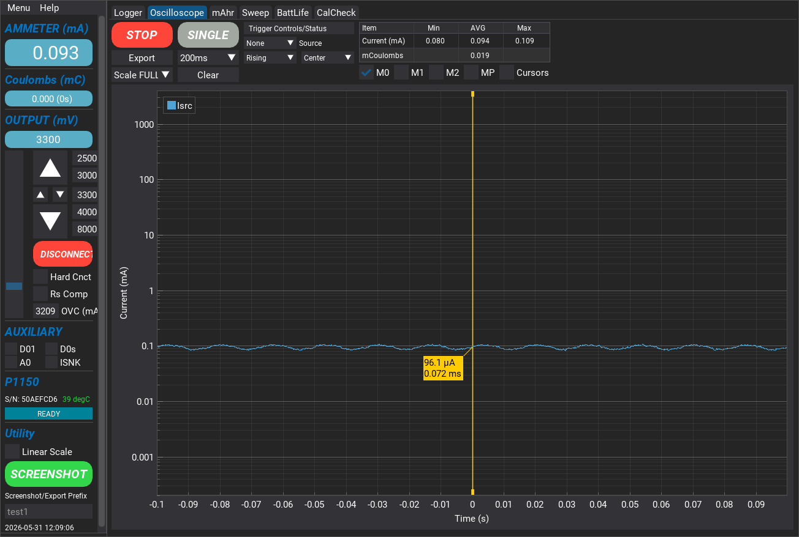
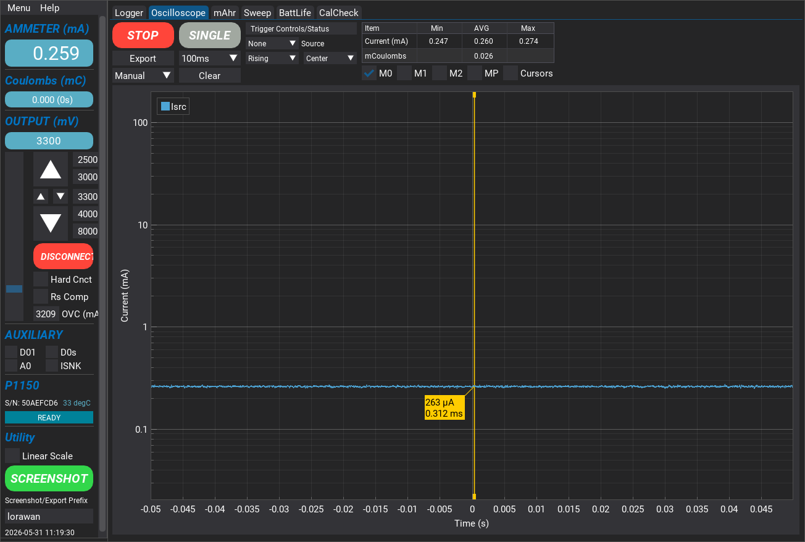
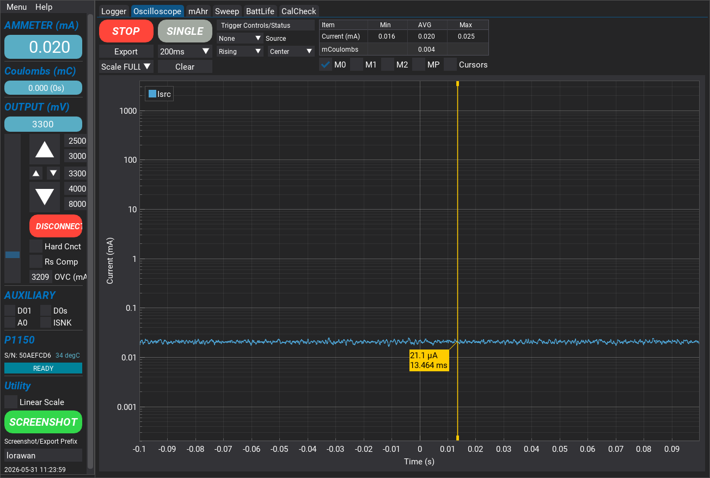
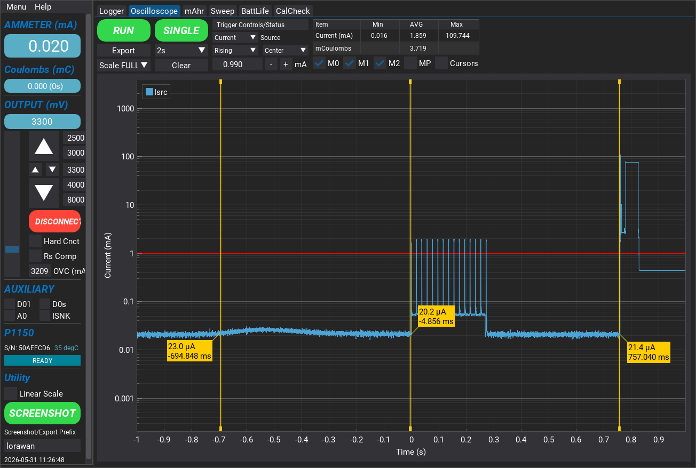
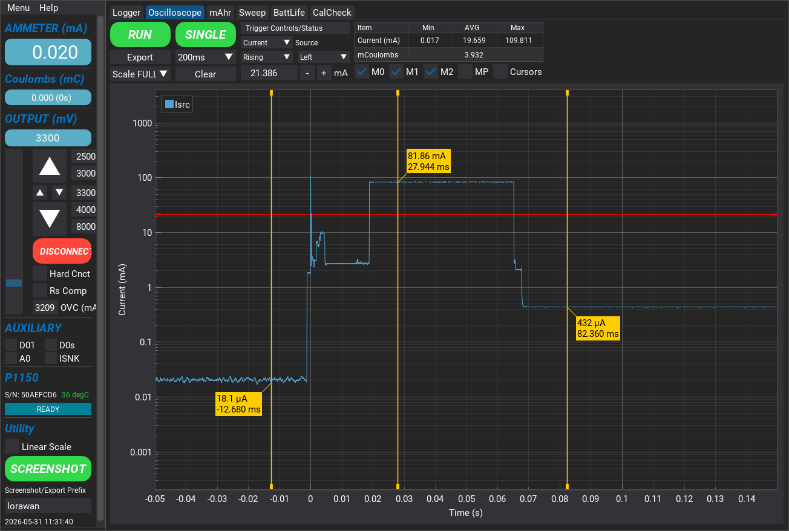
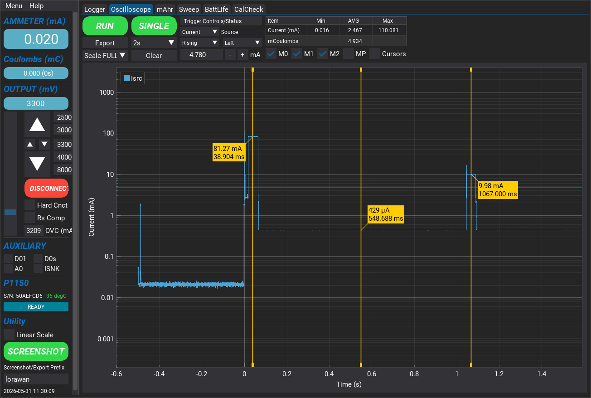

# LoRaWAN Communication

This example demonstrates how to join, send and receive data using the LoRaWAN communication stack.

This example leverages the Amazon IoT Core service to exchange data between the development board and the AWS cloud. It allows a LoRaWAN Network Server (LNS) to control the LED on the development board and receive button press notifications.

**NOTE**: This application can be used with the entire NM1801xx series. Two flash pages are used for the LoRaWAN session context located at the end of the last flash blank.

**⚠ WARNING ⚠**: **Change the operating region prior to running this example.**
Default communication occurs in the 900MHz ISM band for use in North America. This frequency may be restricted in other regions.

## Table of Contents
1. [Application Description](#application-description)
2. [Task Priorities](#task-priorities)
3. [Command Line Interface](#command-line-interface)
4. [AWS IoT Core](#aws-iot-core)
5. [Communication Rate Limitations](#communication-rate-limitations)
6. [Security Keys Storage Considerations](#security-key-storage-considerations)
7. [Power Management Considerations](#power-management-considerations)
8. [Current Draw Measurement Summary](#current-draw-measurement-summary)

## Prerequisites

Complete the following setup steps to prepare cloud resources and device credentials:

1. [AWS IoT Core Integration](doc/aws_iot_core_integration.md)
2. [Adding a LoRaWAN gateway in AWS IoT Core](doc/aws_iot_add_gateway.md)
3. [Adding a LoRaWAN device in AWS IoT Core](doc/aws_iot_add_device.md)

In addition, a LoRaWAN gateway is required to interface the development board with AWS IoT Core.

## Build the Application

For instructions on how to build this reference application and flash the binary to the NM1801XX, follow along step by step in the [Getting Started](doc/getting_started.md) guide.

## Regional Settings

**⚠ WARNING ⚠**: Locate the function call `lorawan_network_config` in
`application_task.c` and adjust the operating region to ensure compliance
with your local laws.

## Application Description

### LoRaWAN Protocol Stack API

The application firmware interacts with the LoRaWAN protocol stack with the API
defined in `lorawan.h`.

`lorawan_task` implemented in `lorawan_task.c` handles all the transport layer (OSI layer 4) operations and application layer callback execution.

Three extension packages are implemented, they are:

- Compliance for certifications.
- Clock Sync for network time synchronization.
- Multicast for multicast communication session.

By default, up to eight commands and eight transmits can be queued up by
`lorawan_task`. These are defined in `lorawan_task.h` as `LORAWAN_COMMAND_QUEUE_MAX_SIZE`
and `LORAWAN_TRANSMIT_QUEUE_MAX_SIZE` respectively. Users can adjust the values to
better fit their application requirements.

#### Network Time Synchronization

After a successful join, the stack will issue a MAC layer time sync command. This
is transparent to the application layer and is performed by the call
`LmHandlerDeviceTimeReq`.

Network time synchronization is only available on LNSs that support this feature. Time synchronization is available on AWS, The Things Network, and Chirpstack, but may not be available on others.

For usage with a LNS that does not support this feature, comment out `LmHandlerDeviceTimeReq` in
`lorawan_task.c` and `lorawan_request_time_sync` in `application_task.c`. There is no
operational impact if the commands are left in the code as the MAC command will be silently
dropped on LNSs that do not support this feature. For applications that roam across
different LNSs, it may be best to leave these calls in place.

#### Multicast Session

During a multicast session, the default behavior of the stack is to silently drop device transmissions. While the LoRaWAN specification does not prevent an application from transmitting during a multicast session, doing so in practice can impact downlink messages from the LNS.

Applications required to transmit during multicast can comment out the following block inside `lorawan_task_handle_uplink` of `lorawan_task.c`:

```
if (LmhpRemoteMcastSessionStateStarted())
{
    return;
}
```

#### Uplink

To transmit a packet, use `lorawan_transmit`. This API performs a
deep-copy of the payload data so the application layer can pass in data declared on the stack without the risk of data corruption.

#### Downlink

For downlink packets, register a callback for the event `LORAWAN_EVENT_RX_DATA` as shown
in `setup_lorawan` in `application_task.c`

```
lorawan_event_callback_register(LORAWAN_EVENT_RX_DATA, on_lorawan_receive);
```

The callback `on_lorawan_receive`, executed within `lorawan_task`, is highly latency sensitive. Processing overhead can be reduced by first copying the payload to a local buffer and then sending a message to `application_task` for further processing and execution within the `application_task` context.

In this example, we blink the LED twice when a packet is received. Note that there is no deep-copy performed
on downlink in this example and the payload data is only valid until the next downlink.

### Persistent LoRaWAN Session Context

The LoRaWAN stack uses the on-chip flash to store the session context. By default, two pages
at the end of the flash region are used for storage. This is defined in the file
`lorawan_config.h` located within the NMSDK2 directory at `targets\nm1801xx\common\comms\lorawan`.

The relevant parameters are `LORAWAN_EEPROM_START_ADDRESS` which indicates the starting page address
and `LORAWAN_EEPROM_NUMBER_OF_PAGES` which indicates the number of pages used.

If these parameters are changed, the lorawan library must be re-built. This can be accomplished by setting the
`BUILD_LORAWAN` macro to true in `.vscode/settings.json` located at the application root folder:

```
"cmake.configureArgs": [
    "-Wno-dev",
    "-DCMAKE_VARIANT_BSP=${variant:bsp}",
    "-DFEATURE_RAT_LORAWAN_ENABLE=ON",
    "-DBUILD_LORAWAN=ON",
]
```

**NOTE**: The build process uses CMake. Always do a clean re-configure prior to re-building after any configuration parameter changes.

**⚠ WARNING ⚠**: For applications that make use of both BLE and LoRa radios, adjust the addresses
of the session context if required for both BLE and LoRaWAN to ensure no address collisions occur
between the two protocol stacks.

### Using Button and LED Controls

This example uses two additional UI features that exist in many battery powered IoT applications. A short button press on BTN_0 triggers a transmit. An LED double blink `LED_COMMAND_PULSE2` is used to indicate receive.

Typical usage of these UI features ranges from deployment, to entering into certification mode, or
entering developer mode to manually execute specific commands.

## Task Priorities

The application runs in an RTOS and demonstrates the importance of setting task
priorities properly.

By default, the SDK defines seven priorities ranging from the lowest priority
zero to the highest priority six.

The OS software timer runs at the highest priority; all software timer callbacks run at priority six and should have the lowest latency.

Radio communication related tasks run at priority level five to accommodate
real-time constraints required in receive operations.

The remaining assignments are at lower priorities. In this example, the button
task is set at priority four and the LED task is set at priority three to ensure that
user interaction has minimal delays.

## Command Line Interface

This application includes a command line interface (CLI) over VCOM or RTT for the user to
directly control LoRaWAN operations.

Connect the EVB or Petal Development Board to the host computer via serial terminal to access the CLI.
For a list of supported commands and usage, type `lorawan help` at the command
prompt.


For example, to join the network from the command line, enter `lorawan join`. The join
procedure could take anywhere from 10 seconds to 2 minutes. A successful
join will show the following:


To transmit, short press BTN_0 or type `lorawan send 1 0 <payload>` in the
CLI. The following will be shown after a successful transmit:


The LNS may at times send MAC commands to the device. This usually
occurs during the first few transmits or after a class switch. MAC messages are communicated over port zero, as shown below:


Issue a class change command to switch to Class A or Class C. For example, issue `lorawan class set C` followed by a transmit to switch to Class C, as shown below:


Note: In AWS if a device profile has Class C enabled, the downlink message will not be queued regardless if the device has been switched over to Class C or not.

## AWS IoT Core

To view device transmit data from the AWS Console, navigate to the `MQTT test client`
in AWS. Subscribe to the MQTT topic that used during the device
destination setup and perform a transmit.


There is no data retention in the test client so it must be active before a transmit
occurs.

To send a packet to the device, navigate to the device dashboard (under LPWAN devices -> Devices)
and select Device traffic. Click on `Queue downlink message` and enter the port and payload.

If the device is operating in Class A, the packet will be sent to the device when the next uplink occurs.

If the device has Class C support, the packet will be sent immediately after network processing (regardless of whether or not the device has switched to Class C).


## Communication Rate Limitations

LoRaWAN is not intended to be a real-time protocol. Excessive transmissions may lead to
undefined behavior and could violate duty-cycle limits in some regions such as the EU.

For example, in Class A operation there are two receive slots with a delay offset from transmit of one second
and two seconds respectively. Transmitting more often than every three seconds would prevent the device
from properly receiving downlink packets and cause undefined behavior in the protocol stack.
Additional delay parameters may also exist in the LNS that further constrain how often a transmit
can occur.

How often to transmit depends on the specific application. A battery powered device may opt
to transmit only a few times per day, but a device attached to infrastructure power may transmit
more frequently.

## Security Keys Storage Considerations

The LoRaWAN network keys in this example are hard coded in `application_task.c`.
For production deployment, consider using a provisioning mechanism to deploy
the keys (for example, loading keys into INFO0).

[Contact NMI](https://northernmechatronics.com/contact-us/) for assistance to securely manage provisioning during production or deployment.

## Power Management Considerations

### LoRaWAN Radio

To reduce power consumption, Petal users have full control over the power supply to the LoRa radio (see documentation in [Petal Core schematics](https://northernmechatronics.com/wp-content/uploads/2025/01/SCH-2002965-005-RevB.pdf)
).

Two callbacks are implemented in this example to enable LoRa radio power
management.  This capability is enabled by default through the macro
`LORAWAN_PM_ENABLE`:

```
on_lorawan_sleep
on_lorawan_wake
```

`on_lorawan_sleep` and `on_lorawan_wake` handle the radio shutdown and wake
up respectively.

The current implementation of the LoRaWAN protocol stack completes each radio
transaction with a write to the session context.  The transport layer puts the
radio to sleep when the `LORAMAC_HANDLER_NVM_STORE` event occurs in
`lmh_callbacks.c`.

### Current Draw Measurement Option

This project includes a CMake build option to quickly configure the application for
measuring the current draw.  This option can be enabled by setting the macro
`CURRENT_MEASUREMENT_ENABLE` to ON in CMakeLists.txt:

```
option(CURRENT_MEASUREMENT_ENABLE "" ON)
```

or by enabling the option in `.vscode/settings.json`:

```
    "cmake.configureArgs": [
        "-Wno-dev",
        "-DCMAKE_VARIANT_BSP=${variant:bsp}",
        "-DCURRENT_MEASUREMENT_ENABLE=ON",
    ]
```

When the `CURRENT_MEASUREMENT_ENABLE` option is enabled, all the UI facilities
including the LED and the Serial Console are disabled.

### Disabling the SWD Port

When performing current draw measurement, it is important to disable the SWD port as it can draw more than
90uA of current.  User can double press button 0 to disable the SWD port during current measurement.  This
step is manual as disabling the SWD port will also disable debugging and programming.

## Current Draw Measurement Summary

### Measurement Setup
All the measurements were performed with a high dynamic range measurement power supply without using FET
switching and a sampling rate of 125kHz; a resolution that is three orders of magnitude more than a
single OS clock tick (1ms).  The measurement power supply used in the 
experiment was the P1150 from Sistemi.

Two sets of measurement were included one on the Petal Development Board and 
the other on the Petal Core in complete isolation.

### Petal Core in Isolation
This measurement provides the best case scenario with minimal leakage as it has no other peripherals connected
to the NM1801xx.  The measurement was performed between the V_SYS and GND pin of the Petal Core.  The two plots
below show the importance of disabling the SWD port during current measurement and for deployment.

#### SWD Port Disabled




#### SWD Port Enabled



### Petal Development Board
The following measurements show the current draw when the Petal Core is attached to the Petal Development Board.
The purpose is to provide a reference on the baseline performance when the NM1801xx is connected to the other
peripherals on the development board to facilitate power optimization during development.

This measurement was made at J1400 and the V_SYS switch SW1402 is set to EXT1.

#### Serial Console and SWD Port Enabled



#### Current Measurement Option Enabled



#### LoRaWAN Uplink Profile
This plot shows the uplink profile starting from the button press to booting up the radio,
and then the transmit window.  The current measurement option was enabled in this measurement.



#### LoRaWAN Transmit Window
This plot shows the transmit window in detail.  The transmit current is around 82mA
but would be dependant on the device distance to the gateway and can reach up to 140mA.
After the transmission is done, the radio is put into standby drawing at around 430uA
until the first RX window occurs at 1s later.  The current measurement option was enabled
in this measurement.



#### LoRaWAN Receive Window
This plot shows the first receive window occurring 1s after the transmit.  The current
draw is approximately 10mA when the radio is put into receive mode.  The current measurement
option was enabled in this measurement.


